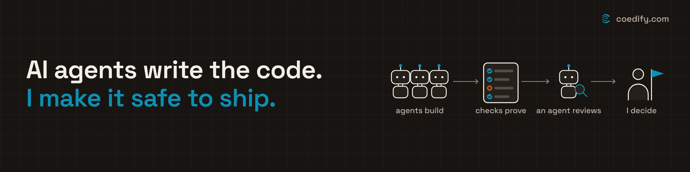

# Md Nadeem

I build production software for companies where a defect becomes a payment, compliance, or operational event.

Founder of [CoEdify](https://coedify.com), a highly efficient product-engineering team in Noida, India. Before that, 7 years at Oracle as an architect on Eloqua, enterprise marketing automation at scale.

### Client work

- **EquippedAI** (now part of Belasko UK), a private-equity management platform. Four engineers, three years: product-suite rebuild, AI integrated into their core platform Minerva, performance work, 75% cloud-cost reduction.
- Banking and fintech product delivery for **Decimal Technologies**. Engineering on **PeLocal's** AI-powered payments platform and **Zeeve's** enterprise blockchain infrastructure. A financial product for **IQGateway**. Insurtech software for **NVest Solutions**.
- Currently building a RAG-based platform with natural-language data querying for **Kliq Analytics** (Canada).

### Products

- **[devsko](https://devsko.com)**, AI hiring and assessment. Live: 10,000+ candidates evaluated, 200+ companies hiring on it.
- **[revsko](https://revsko.com)**, sales memory for your AI assistant: account research, sales conversations and follow-ups in one workspace, so you know who to contact next and what to say. You do the sending. We run CoEdify's own outbound on it.

### Open source

[multi-agent-workspace](https://github.com/mdnadeemai/multi-agent-workspace): a file-based workspace template so coding agents start with project context instead of rebuilding it every session.

### Elsewhere

[LinkedIn](https://www.linkedin.com/in/mdnadeem/) · [X](https://x.com/mdnadeemai) · [coedify.com](https://coedify.com) · nadeem@coedify.com
